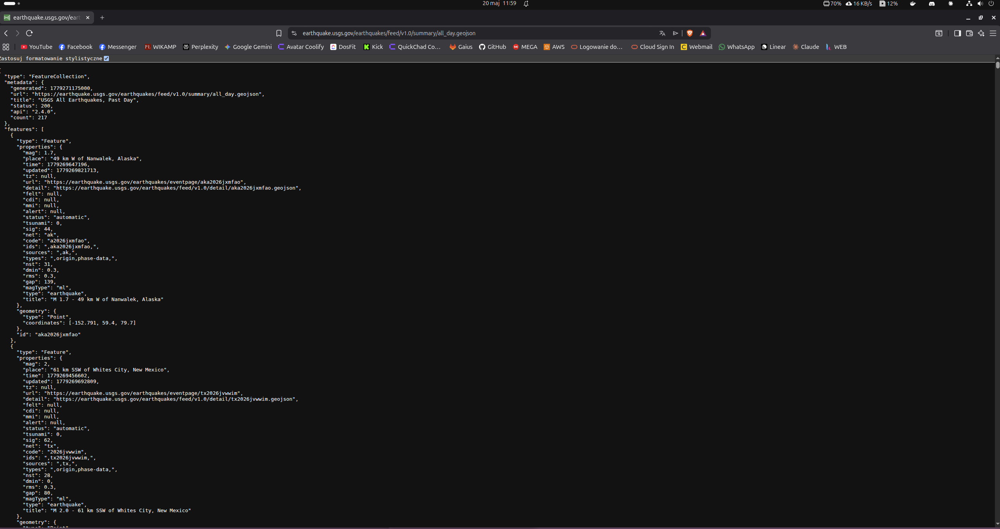
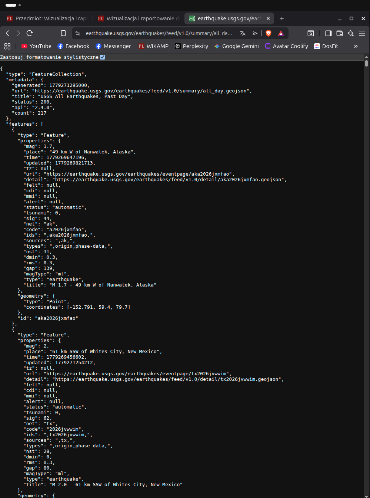
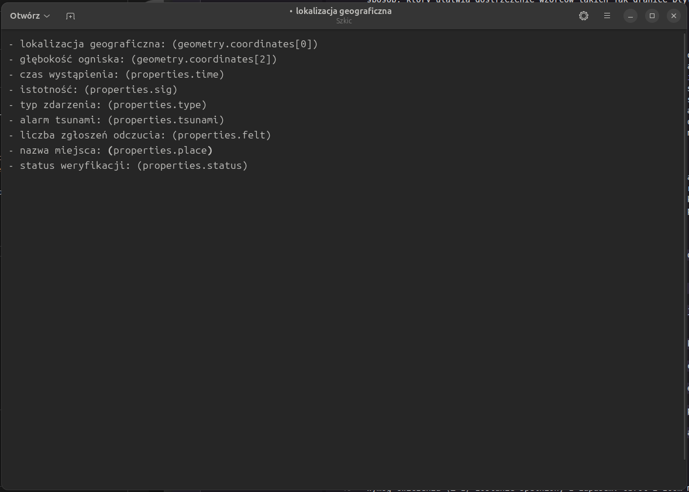
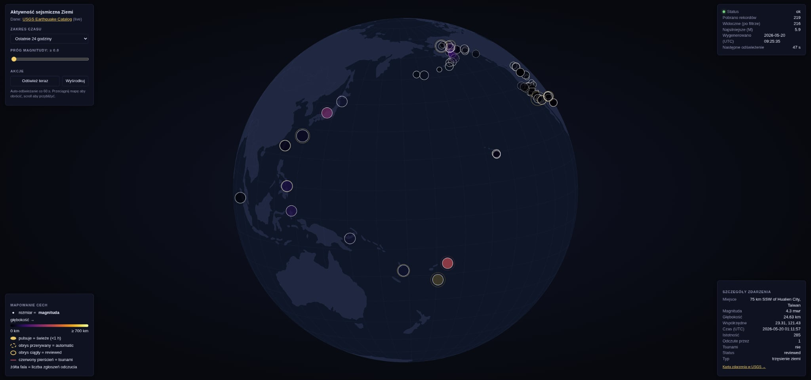
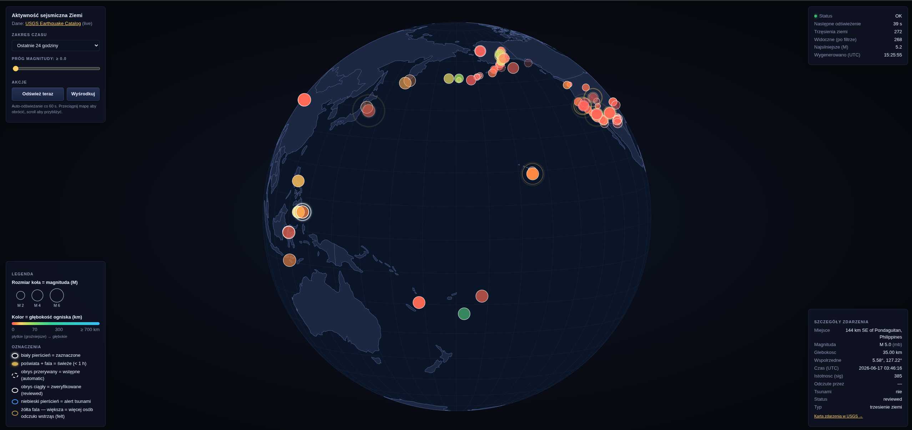
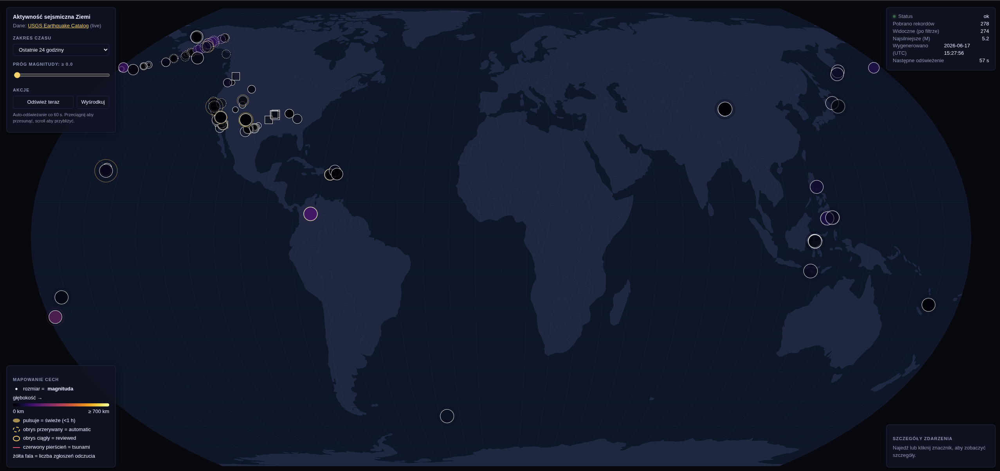

# Dokumentacja procesu: Ćwiczenie 4

**Autor:** Kacper Kleczaj
**Temat:** Aktywność sejsmiczna Ziemi w czasie zbliżonym do rzeczywistego (USGS)

Etapy nazwane wg pipeline'u Bena Fry'a (*acquire → parse → filter → mine → represent → refine → interact*). Dopisywane są w trakcie pracy.

---

## Etap 4.1: Planowanie

### Burza mózgów

Punktem wyjścia były wymagania ćwiczenia: wizualizacja musi opierać się na dynamicznym źródle danych, być interaktywna i nie może być banalna (treść wprost wyklucza wykresy słupkowe, kołowe, liniowe i punktowe). Szukałem więc danych, które żyją w czasie rzeczywistym i mają wiele cech wartych pokazania jednocześnie.

Wybór padł na trzęsienia ziemi z katalogu USGS. Spełniają wszystkie kryteria naraz: feed aktualizuje się co około minutę (dane realnie zmienne w czasie), a pojedynczy rekord niesie kilkanaście cech do zmapowania, między innymi położenie, magnitudę, głębokość, czas, liczbę zgłoszeń odczucia, alarm tsunami czy status weryfikacji. To dawało przestrzeń na bogate, wielowymiarowe kodowanie wizualne zamiast prostego wykresu.

Co do formy, początkowo zaplanowałem płaską mapę świata w projekcji Equal Earth. Pokazuje całą Ziemię naraz i jest czytelna na pierwszy rzut oka, a przy tym nie jest trywialnym prostokątem równoodległościowym. (Formę tę zweryfikowałem później w praktyce, patrz etap Refine.)

### Acquire (zdobądź dane)

Wybrane źródło to USGS Earthquake Catalog, czyli feedy GeoJSON dla okien `hour / day / week / month`, bez klucza i bez rejestracji. W momencie snapshottu feed dobowy zwracał 217 rekordów (`snapshots/feed_metadata.json`):

```json
{
  "generated": 1779270476000,
  "url": "https://earthquake.usgs.gov/earthquakes/feed/v1.0/summary/all_day.geojson",
  "title": "USGS All Earthquakes, Past Day",
  "status": 200,
  "api": "2.4.0",
  "count": 217
}
```



### Parse (zweryfikuj strukturę)

Zanim zaplanowałem mapowanie cech, sprawdziłem, czy nazwy pól z planu na pewno są w odpowiedzi API. Wszystkie 26 pól się zgadza, `geometry.coordinates` to potwierdzone `[longitude, latitude, depth_km]`.



Reprezentatywny rekord w Japoni, na nim widać prawie wszystkie środki wyrazu naraz:

```json
{
  "type": "Feature",
  "properties": {
    "mag": 5.9,
    "place": "8 km E of Wadomari, Japan",
    "time": 1779245184884,
    "updated": 1779266147627,
    "tz": null,
    "url": "https://earthquake.usgs.gov/earthquakes/eventpage/us6000syw4",
    "detail": "https://earthquake.usgs.gov/earthquakes/feed/v1.0/detail/us6000syw4.geojson",
    "felt": 19,
    "cdi": 3.6,
    "mmi": 4.728,
    "alert": "green",
    "status": "reviewed",
    "tsunami": 0,
    "sig": 542,
    "net": "us",
    "code": "6000syw4",
    "ids": ",us6000syw4,",
    "sources": ",us,",
    "types": ",dyfi,ground-failure,losspager,moment-tensor,origin,phase-data,shakemap,",
    "nst": 109,
    "dmin": 0.69,
    "rms": 1.28,
    "gap": 19,
    "magType": "mww",
    "type": "earthquake",
    "title": "M 5.9 - 8 km E of Wadomari, Japan"
  },
  "geometry": {
    "type": "Point",
    "coordinates": [
      128.7336,
      27.392,
      42
    ]
  },
  "id": "us6000syw4"
}
```



### Co wyszło na koniec etapu

Zamysł: Mapa 2D Equal Earth, stack: HTML5 + D3 v7 + topojson-client (bez Node-a), 10 zaplanowanych cech, 5 elementów interaktywnych, auto-odświeżanie co 60 s.

---

## Etap 4.2: Pierwszy prototyp (PNG, narzędzie, opis interakcji)

Kamień milowy 4.2 wymagał oddania: jednego rastra (PNG/JPG) ze stanem projektu, nazwy narzędzia oraz krótkiego opisu planowanej interakcji. W tym momencie powstała pierwsza działająca, klikalna wersja aplikacji. Co ważne, po oddaniu 4.1 prowadzący podsunął pomysł formy 3D, więc już na tym etapie odszedłem od planowanej płaskiej mapy Equal Earth na rzecz obracanego globu (projekcja `geoOrthographic`). Procesowo obejmuje to etapy **Filter**, **Mine** i **Represent** wg Bena Fry'a.

### Narzędzie / framework / język

**Stack:** HTML5 + JavaScript (**D3.js v7**) + topojson-client. D3 nie generuje gotowych wykresów, cały rysunek (projekcja, kula, znaczniki, kolory, skale) piszę ręcznie, biblioteka dostarcza jedynie narzędzia do wiązania danych z elementami DOM oraz pomocnicze funkcje geo/skali. Spełnia to wymóg ćwiczenia, by nie używać narzędzi z gotowymi wizualizacjami „do podpięcia źródła".

### Opis planowanej interakcji

Obrót globu metodą click-and-drag (rotacja po osiach X/Y) i przybliżanie scrollem. Po najechaniu na znacznik pojawia się tooltip z nazwą miejsca, magnitudą i głębokością. Kliknięcie znacznika otwiera panel szczegółów (czas, współrzędne, status, liczba odczuć, alert tsunami) z linkiem do karty USGS. Suwak magnitudy i selektor okna czasu (1h/24h/7d/30d) natychmiast przerysowują widoczne punkty. Dane odświeżają się automatycznie co 60 s.

### Filter (odfiltruj to, co istotne)

Surowy feed dobowy to ~218 rekordów po 26 pól, ale nie wszystko trafia na mapę. Na poziomie danych zostawiam wyłącznie zdarzenia typu `earthquake` (feed zawiera też `quarry blast`, `explosion`, `ice quake` itp.) oraz rekordy z kompletem współrzędnych, bo pozostałe typy bywają mylące przy odczycie aktywności sejsmicznej. Dodatkowo użytkownik filtruje zbiór w czasie rzeczywistym suwakiem progu magnitudy oraz przełącznikiem zakresu czasu (`hour / day / week / month`), więc ten sam pipeline obsługuje od kilku do kilku tysięcy punktów bez zmian w kodzie.

```js
const filtered = state.features.filter(f => {
  const mag = f.properties.mag ?? 0;
  const isQuake = (f.properties.type || "earthquake") === "earthquake";
  const hasCoords = f.geometry?.coordinates?.length >= 2;
  return isQuake && hasCoords && mag >= state.magMin;
});
```

Z 26 pól rekordu do warstwy wizualnej realnie wykorzystuję ~10 (`mag`, `coordinates[0..2]`, `time`, `felt`, `tsunami`, `status`, `place`, `type`), reszta (`sig`, `magType`, `url`, `updated`…) ląduje wyłącznie w panelu szczegółów po kliknięciu.

### Mine (policz to, co potrzebne do kodowania)

Z przefiltrowanego zbioru wyłuskuję wartości sterujące kodowaniem wizualnym:

- **zakresy skal:** magnituda `0–8` → promień `1.5–22 px` (`scaleSqrt`, bo pole koła ma rosnąć liniowo z energią, nie promień), głębokość `0–700 km` → gradient kolorów, `felt 0–5000` → promień fali.
- **wiek zdarzenia:** `(teraz − time)` w godzinach, mapowany na przezroczystość (świeże jasne, stare blakną) oraz flagę „świeże" (`< 1 h`) sterującą pulsacją i poświatą.
- **statystyki nagłówka:** liczba wszystkich trzęsień, liczba widocznych po filtrze, najsilniejsze M, czas wygenerowania feedu, odliczanie do następnego odświeżenia.

```js
// pole koła ~ magnituda → pierwiastek z magnitudy na promień
const rScale     = d3.scaleSqrt().domain([0, 8]).range([1.5, 22]).clamp(true);
const depthScale = d3.scaleLinear()
  .domain([0, 35, 70, 150, 300, 700])
  .range(["#ff5d5d", "#ff8c42", "#ffd166", "#9be15d", "#34d399", "#38bdf8"])
  .clamp(true);
const feltScale  = d3.scaleSqrt().domain([0, 5000]).range([0, 60]).clamp(true);
```

### Represent (dobierz formę i środki wyrazu)

Forma to mapa świata renderowana w SVG przez D3 v7 + topojson-client, bez budowania (czysty HTML + JS, biblioteki z CDN). Warstwy rysowane są w stałej kolejności: kula/ocean → siatka południków → kontury państw → znaczniki trzęsień. Każdy znacznik to grupa `<g>` z kilku nałożonych kół, dzięki czemu jeden punkt koduje naraz wiele cech.

| Cecha danych | Środek wyrazu |
|---|---|
| lokalizacja (`coordinates[0..1]`) | pozycja znacznika na mapie |
| magnituda (`mag`) | rozmiar koła |
| głębokość (`coordinates[2]`) | kolor (czerwony płytkie → niebieski głębokie) |
| czas / świeżość (`time`) | przezroczystość + pulsacja + poświata (`< 1 h`) |
| liczba odczuć (`felt`) | promień żółtej fali |
| alarm tsunami (`tsunami`) | niebieski pierścień |
| status weryfikacji (`status`) | obrys przerywany (`automatic`) / ciągły (`reviewed`) |
| nazwa miejsca (`place`) | etykieta w tooltipie |
| typ, istotność, współrzędne, czas UTC | panel szczegółów |
| zaznaczenie | biały pulsujący pierścień |

Na koniec 4.2 oddałem zatem: render PNG ze stanem prototypu (globus, `app-final.JPG`), nazwę narzędzia (D3.js v7) i powyższy opis interakcji.



*Stan prototypu na etapie 4.2: globus ortograficzny z naniesionymi trzęsieniami.*

---

## Etap 4.3: Interakcja (wideo): Interact

Kamień milowy 4.3 wymagał oddania nagrania (MP4/MOV, kodek H.264/H.265) prezentującego metody interakcji. Procesowo to etap **Interact** wg Bena Fry'a. Interakcja realizuje zasadę stopniowania informacji, domyślnie widać rozkład i skalę aktywności, a szczegóły użytkownik odsłania sam:

- **obrót globu** przeciągnięciem myszą oraz **zoom** scrollem (`d3.zoom`, zakres 0.5×–8×),
- **suwak progu magnitudy:** filtruje widoczne zdarzenia w czasie rzeczywistym,
- **przełącznik zakresu czasu:** godzina / dzień / tydzień / miesiąc,
- **„Odśwież teraz"** plus **auto-odświeżanie co 60 s** z widocznym odliczaniem,
- **„Wyśrodkuj":** przywraca domyślną orientację globu,
- **tooltip** po najechaniu i **panel szczegółów** po kliknięciu znacznika (z linkiem do karty zdarzenia w USGS).

Oddane wideo (`interakcja.mp4`) pokazuje kolejno każdą z tych metod na żywych danych.

---

## Etap 4.4: Wersja końcowa (oddanie wynikowe)

Kamień milowy 4.4 to oddanie końcowe: uruchomieniowa wizualizacja, instrukcja uruchomienia, opis najważniejszej przekazywanej informacji, uzasadnienie realizacji celu i wyboru formy oraz wideo z działania. Procesowo zamyka go etap **Refine**.

### Wynikowa wizualizacja

Wersją uruchomieniową jest katalog `final/` (globus ortograficzny). To czysty front: `index.html` + `app.js` + biblioteki z CDN, bez kroku budowania.



### Instrukcja uruchomienia

Przeglądarki blokują część żądań `fetch` przy otwarciu przez `file://`, więc potrzebny jest lokalny serwer HTTP. W katalogu `final/`:

```bash
python3 -m http.server 8000
```

a następnie w przeglądarce: <http://localhost:8000/>. Alternatywnie `npx --yes serve .`. Pierwsze pobranie konturów państw i danych USGS może zająć 1–2 sekundy.

### Najważniejsza informacja

Wizualizacja odpowiada na pytanie: **gdzie i jak silnie Ziemia trzęsie się teraz?** Najważniejszy przekaz to przestrzenny rozkład i skala bieżącej aktywności sejsmicznej, czyli to, że wstrząsy nie są losowe, lecz układają się wzdłuż granic płyt tektonicznych (przede wszystkim Pacyficznego Pierścienia Ognia), oraz które zdarzenia są świeże, silne i płytkie (czyli potencjalnie najgroźniejsze).

### Uzasadnienie realizacji celu

Cel z planu 4.1, czyli pokazanie skali i rozkładu przestrzennego aktywności sejsmicznej w czasie zbliżonym do rzeczywistego, jest zrealizowany: dane pochodzą wprost z żywego feedu USGS i odświeżają się co 60 s, lokalizacja każdego zdarzenia jest naniesiona na mapę, a magnituda, głębokość i świeżość są jednocześnie zakodowane wielkością, kolorem i animacją. Zapowiadane wzorce (granice płyt, sekwencje wstrząsów wtórnych) są czytelne bez analizy liczb, a pojedyncze zdarzenie można doczytać w panelu szczegółów.

### Uzasadnienie wyboru formy

Mapa to naturalna forma dla danych geoprzestrzennych, bo lokalizacja mapuje się 1:1 na pozycję, bez pośredniej abstrakcji. Globus ortograficzny dodatkowo wspiera przekaz: prezentuje aktywność jako spójne łuki wzdłuż granic płyt (prostokątna projekcja rozcinałaby Pierścień Ognia na krawędziach), nie jest też trywialnym wykresem wykluczonym w treści ćwiczenia. Nałożenie wielu środków wyrazu na jeden znacznik (rozmiar, kolor, animacja, pierścienie) pozwala odczytać kilka cech naraz w jednym spojrzeniu, a stopniowanie informacji (tooltip, potem panel) nie przeładowuje widoku domyślnego.

### Wideo z działania

Oddane wideo (`final.mp4`, kodek H.264) prezentuje działanie wersji końcowej na żywych danych.

### Refine (iteracje i powroty do wcześniejszych kroków)

Zgodnie z nieliniowym charakterem modelu Bena Fry'a kilka decyzji wymagało cofnięcia się do wcześniejszych etapów:

- **Iteracja 1: zmiana formy z płaskiej mapy na globus (po 4.1).** Plan 4.1 zakładał płaską mapę w projekcji Equal Earth (zachowany jako wariant `final-v2/`). Po oddaniu 4.1 prowadzący podsunął pomysł formy 3D, więc już do 4.2 przeszedłem na obracany globus (`geoOrthographic`, `final/`). Globus mocniej oddaje, że aktywność układa się wzdłuż granic płyt (np. Pacyficzny Pierścień Ognia widać jako spójny łuk, a nie rozcięty krawędziami prostokąta) i lepiej broni się przed zarzutem „banalnej mapy". Wymagało to powrotu do etapu Represent (ukrywanie punktów z niewidocznej półkuli) i zmiany modelu interakcji (obrót zamiast przesuwania).
- **Iteracja 2: poprawki czytelności po testach.** Po przejrzeniu działającej wersji wspólnie z prowadzącym wyłapaliśmy kilka szczegółów, które potem naprawiłem:
    - status połączenia wyświetlany jako **OK** (wielkimi literami),
    - w tabeli statystyk w prawym górnym rogu czas był przesunięty względem pozostałych wartości, więc wyrównałem kolumnę,
    - **kolory głębokości:** czarny na ciemnym tle dawał niski kontrast, więc przeskalowałem gradient na barwy widoczne na ciemnym (czerwony → pomarańczowy → żółty → zielony → niebieski),
    - dodałem **legendę rozmiaru kółek** (przykładowe M2 / M4 / M6), której wcześniej brakowało,
    - **zaznaczone zdarzenie** było nie do odróżnienia, więc zdecydowanie poprawiłem kontury znaczników i legendę, dodając wyraźny biały pierścień zaznaczenia.
- **Iteracja 3: porządki w UI.** Przyciski dostały wygląd realnych przycisków (gradient, cień, stan wciśnięcia), a licznik „Następne odświeżenie" przeniosłem bezpośrednio pod status, bo logicznie należy do bloku stanu połączenia.



## Podsumowanie

Proces potwierdził iteracyjny i nieliniowy charakter pipeline'u Bena Fry'a: kluczowa była zmiana formy prezentacji tuż po 4.1, z planowanej płaskiej mapy Equal Earth na obracany globus (pomysł prowadzącego), która wymusiła powrót do reprezentacji i interakcji, oraz późniejsze uproszczenie kodu, które poprawiło czytelność bez zmiany efektu wizualnego. Efekt końcowy spełnia cel komunikacyjny: szybki, intuicyjny odczyt bieżącej aktywności sejsmicznej Ziemi z żywego źródła danych USGS, z możliwością drążenia szczegółów pojedynczego zdarzenia.
